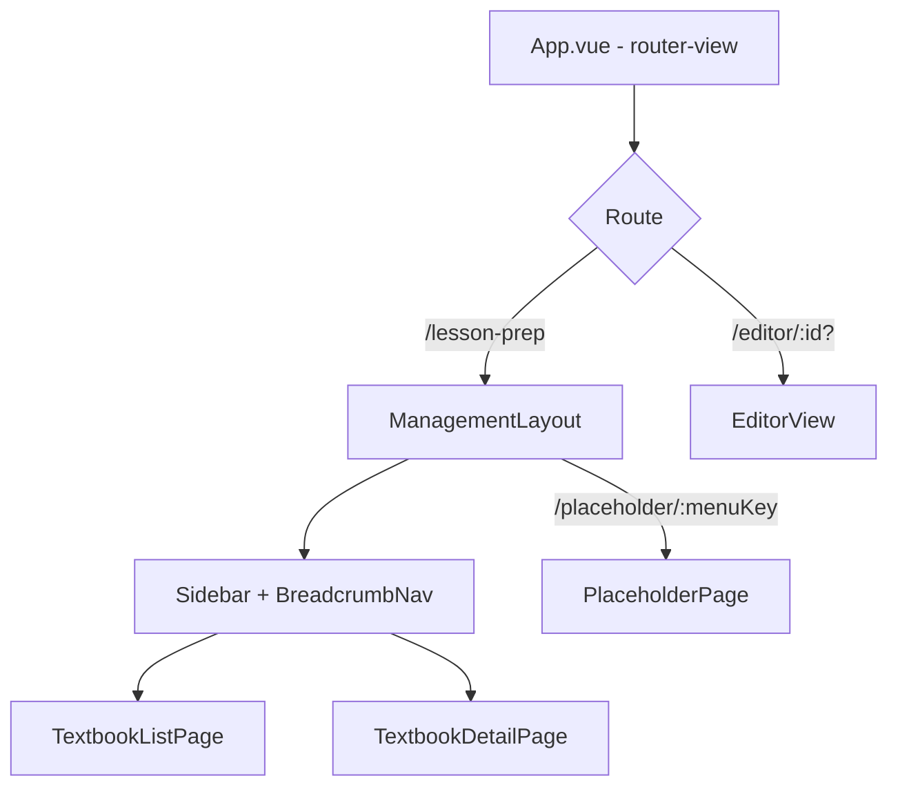

# Design Document: 备授课管理 (Lesson Preparation Management)

## Overview

本设计为 PPTist 项目新增备授课管理模块，包含教材列表页和教材详情页两个核心页面，以及新建在线课件流程。核心技术挑战是在不破坏现有 PPTist 编辑器功能的前提下引入 Vue Router，实现多页面导航。

当前为 demo 阶段，所有数据使用 mock JSON 文件驱动，纯前端运行。

### 关键设计决策

1. **Vue Router 引入策略**：采用 `createWebHashHistory` 模式，避免服务端配置需求，适合 demo 阶段部署。
2. **编辑器兼容方案**：将现有 `App.vue` 中的编辑器逻辑下沉到 `/editor` 路由对应的视图组件中，`App.vue` 仅保留 `<router-view>` 和全局布局。
3. **布局分层**：备授课管理页面使用独立的 `ManagementLayout`（含 Sidebar + BreadcrumbNav），编辑器页面保持原有全屏布局，两套布局通过路由切换。
4. **Mock 数据模式**：沿用项目现有的 `public/mocks/*.json` + `api.getMockData()` 模式，新增教材/教程/课件相关 JSON 文件。

## Architecture

### 路由架构



### 路由配置

| 路径 | 组件 | 布局 | 说明 |
|------|------|------|------|
| `/` | — | — | 重定向到 `/lesson-prep` |
| `/lesson-prep` | TextbookListPage | ManagementLayout | 教材列表页 |
| `/lesson-prep/:textbookId` | TextbookDetailPage | ManagementLayout | 教材详情页 |
| `/editor` | EditorView | 无（全屏） | PPTist 编辑器（新建） |
| `/editor/:coursewareId` | EditorView | 无（全屏） | PPTist 编辑器（编辑课件） |
| `/placeholder/:menuKey` | PlaceholderPage | ManagementLayout | 未开发功能占位页 |

### 页面布局结构

```
┌──────────────────────────────────────────────┐
│  ManagementLayout                            │
│ ┌──────────┬───────────────────────────────┐ │
│ │ Sidebar  │  Content Area                 │ │
│ │ (200px)  │ ┌───────────────────────────┐ │ │
│ │          │ │ BreadcrumbNav             │ │ │
│ │ Logo     │ ├───────────────────────────┤ │ │
│ │ Menu     │ │                           │ │ │
│ │ Tree     │ │ <router-view />           │ │ │
│ │          │ │ (TextbookListPage /       │ │ │
│ │          │ │  TextbookDetailPage /     │ │ │
│ │          │ │  PlaceholderPage)         │ │ │
│ │          │ │                           │ │ │
│ │          │ └───────────────────────────┘ │ │
│ └──────────┴───────────────────────────────┘ │
└──────────────────────────────────────────────┘
```

## Components and Interfaces

### 新增文件清单

```
src/
├── router/
│   └── index.ts                    # Vue Router 配置
├── views/
│   └── LessonPrep/
│       ├── ManagementLayout.vue    # 管理页面布局（Sidebar + Breadcrumb + router-view）
│       ├── Sidebar.vue             # 左侧导航栏
│       ├── BreadcrumbNav.vue       # 面包屑导航
│       ├── TextbookListPage.vue    # 教材列表页
│       ├── TextbookCard.vue        # 教材卡片组件
│       ├── TextbookDetailPage.vue  # 教材详情页
│       ├── CourseManagementTab.vue  # 教程管理 tab
│       ├── CoursewareManagementTab.vue # 课件管理 tab
│       ├── ChapterSelectModal.vue  # 章节选择弹窗
│       └── PlaceholderPage.vue     # 占位页
├── mock/
│   └── lessonPrep.ts               # Mock 数据定义与服务
public/
└── mocks/
    ├── textbooks.json              # 教材列表数据
    ├── courses.json                # 教程列表数据
    ├── coursewares.json            # 课件列表数据
    └── chapters.json               # 章节列表数据
```

### 需修改的现有文件

| 文件 | 改动 | 原因 |
|------|------|------|
| `src/main.ts` | 引入并注册 Vue Router | 路由系统初始化 |
| `src/App.vue` | 替换为 `<router-view />`，移除编辑器直接引用 | 路由分发入口 |
| `package.json` | 添加 `vue-router` 依赖 | 路由库安装 |

### 组件接口定义

#### Sidebar.vue
```typescript
// Props
interface SidebarProps {
  // 无外部 props，内部管理菜单状态
}

// Emits
interface SidebarEmits {
  // 通过 router.push() 导航，无需 emit
}

// 内部状态
interface MenuItem {
  key: string
  label: string
  icon?: string
  route?: string          // 可导航的路由路径
  children?: MenuItem[]
}
```

#### BreadcrumbNav.vue
```typescript
// Props
interface BreadcrumbNavProps {
  items: BreadcrumbItem[]
}

interface BreadcrumbItem {
  label: string
  route?: string  // 可点击跳转的路由，最后一项无 route
}
```

#### TextbookListPage.vue
```typescript
// 内部状态
// - searchKeyword: string
// - activeTab: 'all' | 'favorite'
// - textbooks: Textbook[] (从 mock 加载)
// - filteredTextbooks: computed 根据 searchKeyword 和 activeTab 过滤
```

#### TextbookCard.vue
```typescript
interface TextbookCardProps {
  textbook: Textbook
}

interface TextbookCardEmits {
  (e: 'toggle-favorite', id: string): void
  (e: 'click', id: string): void
}
```

#### TextbookDetailPage.vue
```typescript
// 通过 route.params.textbookId 获取教材 ID
// 内部状态
// - activeTab: 'course' | 'courseware'
// - textbook: Textbook (根据 ID 从 mock 加载)
```

#### CourseManagementTab.vue
```typescript
interface CourseManagementTabProps {
  textbookId: string
}
// 内部状态
// - searchKeyword: string
// - courses: Course[]
// - currentPage: number
// - pageSize: number (默认 10)
```

#### CoursewareManagementTab.vue
```typescript
interface CoursewareManagementTabProps {
  textbookId: string
}
// 内部状态
// - searchKeyword: string
// - coursewares: Courseware[]
// - showChapterModal: boolean
```

#### ChapterSelectModal.vue
```typescript
interface ChapterSelectModalProps {
  visible: boolean
  textbookId: string
  chapters: Chapter[]
}

interface ChapterSelectModalEmits {
  (e: 'close'): void
  (e: 'confirm', chapterId: string): void
}
```


## Data Models

### TypeScript 类型定义

```typescript
// src/types/lessonPrep.ts

/** 教材 */
interface Textbook {
  id: string
  name: string
  coverImage: string       // 封面图片 URL
  coursewareCount: number   // 课件数量
  isFavorited: boolean      // 是否收藏
  isDelisted: boolean       // 是否已下架
}

/** 教程 */
interface Course {
  id: string
  textbookId: string
  name: string
  isOfficial: boolean       // 是否官方教程
  publishedClassCount: number // 已发布班课数
}

/** 课件 */
interface Courseware {
  id: string
  textbookId: string
  name: string
  courseName: string        // 关联教程名称
  slideData?: any           // PPTist 幻灯片数据（可选，用于编辑器加载）
}

/** 章节 */
interface Chapter {
  id: string
  textbookId: string
  name: string
  orderIndex: number        // 排序序号
}

/** 侧边栏菜单项 */
interface MenuItem {
  key: string
  label: string
  icon?: string
  route?: string
  children?: MenuItem[]
}

/** 面包屑项 */
interface BreadcrumbItem {
  label: string
  route?: string
}
```

### Mock 数据结构

**textbooks.json**
```json
[
  {
    "id": "tb-001",
    "name": "新视野大学英语读写教程1",
    "coverImage": "/imgs/textbook_cover_1.webp",
    "coursewareCount": 3,
    "isFavorited": true,
    "isDelisted": false
  }
]
```

**courses.json**
```json
[
  {
    "id": "course-001",
    "textbookId": "tb-001",
    "name": "Unit 1 Fresh Start",
    "isOfficial": true,
    "publishedClassCount": 2
  }
]
```

**coursewares.json**
```json
[
  {
    "id": "cw-001",
    "textbookId": "tb-001",
    "name": "Unit 1 课件",
    "courseName": "Unit 1 Fresh Start"
  }
]
```

**chapters.json**
```json
[
  {
    "id": "ch-001",
    "textbookId": "tb-001",
    "name": "Unit 1 Fresh Start",
    "orderIndex": 1
  }
]
```

### 侧边栏菜单树数据

```typescript
const menuTree: MenuItem[] = [
  { key: 'home', label: '首页', route: '/placeholder/home' },
  {
    key: 'teaching', label: '我的教学',
    children: [
      { key: 'class-center', label: '班课中心', route: '/placeholder/class-center' },
      { key: 'lesson-prep', label: '备授课管理', route: '/lesson-prep' },
      { key: 'supplement', label: '补充资源', route: '/placeholder/supplement' },
      { key: 'homework', label: '作业', route: '/placeholder/homework' },
      { key: 'question-bank', label: '题库', route: '/placeholder/question-bank' },
    ],
  },
  {
    key: 'evaluation', label: '教学评价',
    children: [
      { key: 'assessment', label: '考核方案', route: '/placeholder/assessment' },
      { key: 'grades', label: '综合成绩', route: '/placeholder/grades' },
    ],
  },
  {
    key: 'statistics', label: '数据统计',
    children: [
      { key: 'analytics', label: '学情分析', route: '/placeholder/analytics' },
    ],
  },
]
```


## Correctness Properties

*A property is a characteristic or behavior that should hold true across all valid executions of a system — essentially, a formal statement about what the system should do. Properties serve as the bridge between human-readable specifications and machine-verifiable correctness guarantees.*

### Property 1: Search filter correctness

*For any* list of items (textbooks, courses, or coursewares) and *for any* search keyword, the filtered result should contain exactly those items whose name includes the keyword (case-insensitive), and no matching item should be excluded.

**Validates: Requirements 4.3, 6.7, 7.5**

### Property 2: Favorite tab filter correctness

*For any* list of textbooks with mixed favorite statuses, selecting the "收藏" tab should return exactly those textbooks where `isFavorited` is `true`, and selecting the "全部" tab should return all textbooks regardless of favorite status.

**Validates: Requirements 4.5, 4.6**

### Property 3: Textbook card rendering completeness

*For any* textbook object, the rendered TextbookCard should display the cover image, name, and courseware count. Additionally, the "已下架" label should be visible if and only if `isDelisted` is `true`.

**Validates: Requirements 5.1, 5.4**

### Property 4: Favorite toggle is an involution

*For any* textbook with any initial favorite status, toggling the favorite should flip `isFavorited` to the opposite value. Toggling twice should restore the original state.

**Validates: Requirements 5.3**

### Property 5: Card click navigates to correct detail route

*For any* textbook, clicking its card should trigger navigation to `/lesson-prep/{textbook.id}`, and the TextbookDetailPage should receive the correct `textbookId` as a route parameter.

**Validates: Requirements 5.5, 1.3**

### Property 6: Breadcrumb last segment is not a link

*For any* array of BreadcrumbItems with length ≥ 1, the rendered breadcrumb should make all segments except the last one clickable links, and the last segment should be plain text (not a link).

**Validates: Requirements 3.4**

### Property 7: Official course tag visibility

*For any* course object, the "官方教程" tag should be visible in the table row if and only if `isOfficial` is `true`.

**Validates: Requirements 6.4**

### Property 8: Pagination visibility threshold

*For any* list of courses, the pagination control should be visible when the total count exceeds the page size, and hidden when the total count is less than or equal to the page size.

**Validates: Requirements 6.6**

### Property 9: Chapter selection produces correct courseware

*For any* chapter selected from the chapter list, clicking "生成" should create a new courseware entry whose associated chapter matches the selected one, and the courseware should appear in the courseware table.

**Validates: Requirements 8.3**

### Property 10: Mock data schema completeness

*For any* object in the mock data sets (textbooks, courses, coursewares, chapters), the object should contain all required fields as defined in the data model, with correct types and no missing required fields.

**Validates: Requirements 9.1, 9.2, 9.3, 9.4**

## Error Handling

### 路由错误
- **未匹配路由**：配置 catch-all 路由 `/:pathMatch(.*)*`，重定向到 `/lesson-prep`
- **无效 textbookId**：TextbookDetailPage 在 mock 数据中找不到对应教材时，显示"教材不存在"提示并提供返回列表页的链接
- **无效 coursewareId**：EditorView 在找不到课件数据时，回退到默认空白编辑器行为（与现有行为一致）

### 数据加载错误
- **Mock JSON 加载失败**：使用 try/catch 包裹 fetch 调用，失败时显示空列表 + 错误提示
- **图片加载失败**：TextbookCard 封面图使用 `@error` 事件处理，显示默认占位图

### 用户操作边界
- **空搜索结果**：搜索无匹配时显示"未找到相关内容"提示
- **空课件列表**：显示空状态插图 + "暂无课件" 文案（Requirement 7.4）
- **重复生成课件**：允许同一章节多次生成课件，每次生成独立的课件条目

## Testing Strategy

### 测试框架选择

- **单元测试**：Vitest + Vue Test Utils
- **属性测试**：fast-check（与 Vitest 集成）
- **组件测试**：Vue Test Utils + @testing-library/vue

### 属性测试 (Property-Based Tests)

每个属性测试最少运行 100 次迭代。

| Property | 测试内容 | 生成器 |
|----------|---------|--------|
| Property 1 | 搜索过滤函数 | 随机字符串列表 + 随机关键词 |
| Property 2 | 收藏/全部 tab 过滤 | 随机 Textbook 列表（随机 isFavorited） |
| Property 3 | 卡片渲染完整性 | 随机 Textbook 对象 |
| Property 4 | 收藏切换幂等性 | 随机布尔值 |
| Property 5 | 卡片点击导航 | 随机 textbook ID |
| Property 6 | 面包屑末项非链接 | 随机 BreadcrumbItem 数组 |
| Property 7 | 官方教程标签 | 随机 Course 对象 |
| Property 8 | 分页显示阈值 | 随机长度列表 + 随机 pageSize |
| Property 9 | 章节生成课件 | 随机 Chapter 对象 |
| Property 10 | Mock 数据 schema | 实际 mock JSON 数据 |

标签格式：`Feature: lesson-preparation-management, Property {N}: {description}`

### 单元测试 (Example-Based Tests)

| 测试场景 | 覆盖需求 |
|----------|---------|
| 路由重定向 `/` → `/lesson-prep` | 1.2 |
| 编辑器路由 `/editor` 和 `/editor/:id` 渲染 | 1.4 |
| Sidebar 菜单树结构完整性 | 2.1 |
| Sidebar 点击"备授课管理"导航 | 2.3 |
| Sidebar 菜单组折叠/展开 | 2.5 |
| 面包屑文本：列表页 "我的教学 / 备授课管理" | 3.1 |
| 面包屑文本：详情页包含教材名称 | 3.2 |
| 面包屑点击"备授课管理"返回列表页 | 3.3 |
| 教材列表 3 列网格布局 | 4.1 |
| 搜索输入框 placeholder | 4.2 |
| 详情页默认 tab 为"教程管理" | 6.1 |
| 教程表格列头 | 6.3 |
| 课件管理按钮存在性 | 7.2 |
| 空课件列表显示空状态 | 7.4 |
| 点击"新建在线课件"弹出章节选择弹窗 | 8.1 |
| 生成课件后表格更新 | 8.4 |
| 点击"编辑"导航到编辑器 | 8.5 |
| Mock JSON 文件存在于 public/mocks/ | 9.5 |

### 测试不覆盖项

以下需求为视觉/样式要求，通过人工审查或视觉回归测试验证，不纳入自动化测试：
- Requirement 10（页面布局与视觉还原）：Sidebar 宽度、背景色、卡片阴影、表格样式等
- Requirement 1.5（编辑器无回归）：通过手动集成测试验证
