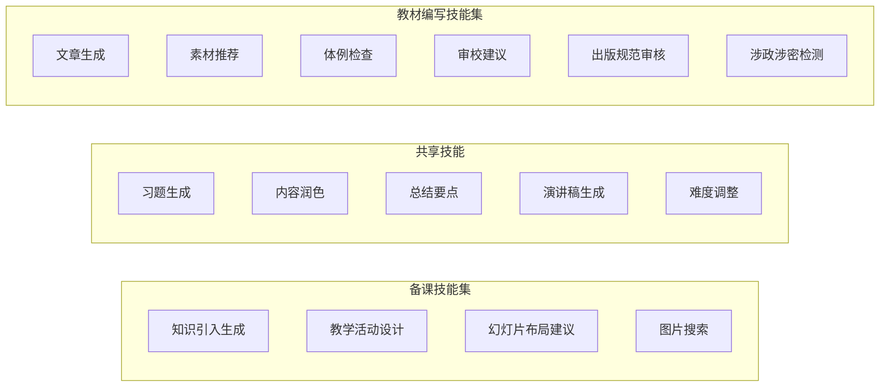
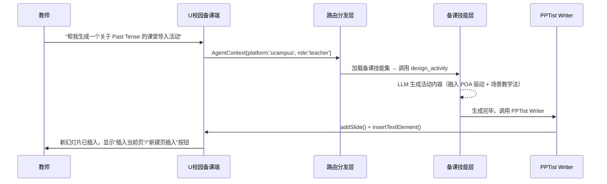
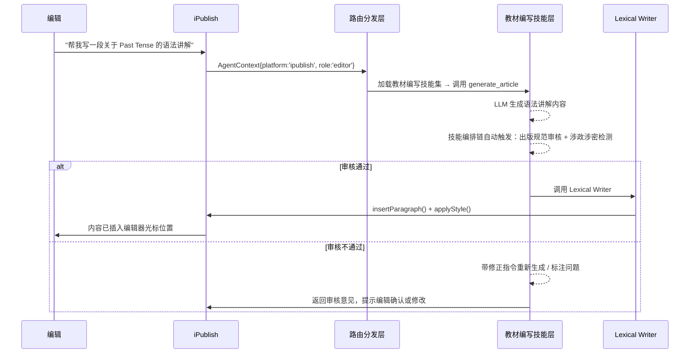
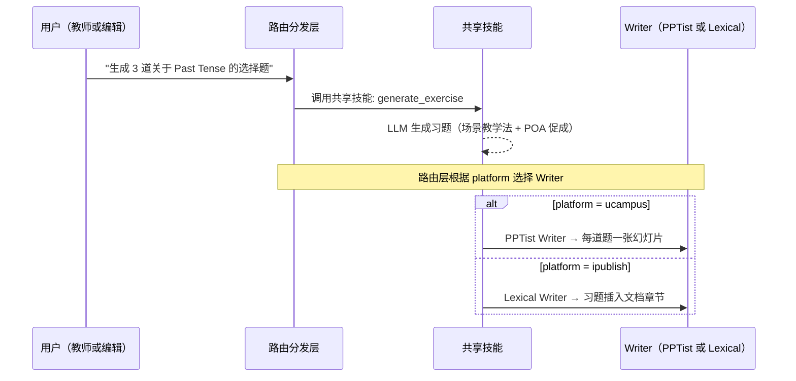

# Requirement: PPT AI 助手（子言）

<!--
@meta
version: 2.3.0
last-updated: 2026-04-27 17:00:00
last-full-rewrite: 2026-04-26
update-mode: incremental
source-hash: ai-assistant-files-v4
analyzed-files: src/views/Editor/AIChatFloating.vue, src/views/Editor/AISidebarPanel.vue, src/views/Editor/aiChatStore.ts, src/views/Editor/aiPptTools.ts, src/views/Editor/aiLocalCommands.ts, src/views/Editor/aiSlideTemplate.ts, src/views/Editor/TypeWriter.vue
@/meta
-->

> 本文档描述 PPT 编辑器中"AI 助手（子言）"功能模块的产品需求。
> 本文档的核心读者是研发团队，聚焦 AI 助手的 Prompt 提示词体系、调用链路、工具定义、拼接逻辑。
> 编辑器本身（PPTist）为已有开源项目，AI 助手通过调用其 Store API 操作 PPT 元素，本文档不描述编辑器基座功能。

---

## 第 1 章：产品概述

### 1.1 功能定位

AI 助手"子言"是嵌入 PPT 编辑器右侧工具栏的智能对话模块。教师通过自然语言与 AI 对话，AI 可以：
- 直接操作 PPT 元素（修改格式、调整布局、添加/删除元素）
- 生成教学内容（课堂引入、例题、互动环节、演讲稿等）供用户选择性插入

### 1.2 核心场景

| 场景 | 用户行为 | AI 响应方式 |
|------|----------|------------|
| 调整元素格式 | 选中文字框 → "字号改大，颜色改红" | 本地指令直接执行（零延迟） |
| 复杂元素操作 | 选中元素 → "把这段话改写得更简洁" | LLM Function Calling |
| 生成教学内容 | "帮我设计一段课堂引入" | LLM 文本回复 + 插入按钮 |
| 优化页面布局 | "优化布局" | 本地指令分析页面类型后自动调整 |
| 修改页面属性 | "背景改成深蓝色" | 本地指令 / LLM Function Calling |

### 1.3 目标用户

大学英语教师和教研人员，需要高效制作课件，希望通过自然语言完成内容生成和格式调整。

---

## 第 2 章：入口与交互

### 2.1 AI 助手入口

AI 助手作为右侧工具栏的一个 tab，与"设计/样式/位置/动画"等 tab 并列。

AI tab 在所有编辑器上下文中始终可见：
- 未选中元素时：设计、切换、动画、AI
- 选中单个元素时：样式、位置、动画、AI
- 选中多个元素时：样式、位置、AI

特殊规则：当用户处于 AI tab 时，选中/取消选中元素不会自动切走，保持在 AI tab。

### 2.2 侧边栏面板

AI tab 被选中时，侧边栏显示以下内容（从上到下）：

1. **新建对话按钮** — 点击创建空会话并打开悬浮对话框
2. **历史记录列表** — 每条记录显示：图标（对话/元素调整）+ 标题 + 消息数 + 时间
   - 只显示有消息的会话（空会话不显示）
   - 点击打开该会话的悬浮对话框
   - 当前活跃会话高亮显示
   - 无记录时显示空状态图标 + "暂无对话记录" + "点击上方按钮开始"
3. **底部 Tips 轮播栏** — 固定在侧边栏底部，循环展示使用提示

### 2.3 Tips 轮播

侧边栏底部固定显示一条 Tips 提示，自动轮播引导用户了解 AI 能力：

**轮播规则**：
- 每 7 秒自动切换到下一条
- 双击可手动切换到下一条
- 文字超出容器宽度时，停留 4 秒后自动向左滚动（速度 30px/秒）

**Tips 内容列表**（共 10 条，循环播放）：

| 序号 | 内容 |
|------|------|
| 1 | 选中文字后跟我说"字号改成30"，立刻生效 |
| 2 | 想用时事做课堂引入？不妨问问 AI |
| 3 | 让 AI 帮你设计课堂互动活动吧！ |
| 4 | 选中元素后说"改成红色"，AI 秒改 |
| 5 | AI 可以帮你生成演讲稿并插入备注 |
| 6 | 说"背景改成深蓝色"，一句话换背景 |
| 7 | 让 AI 帮你出几道选择题，难度随你定 |
| 8 | 选中文字说"加粗居中"，排版一步到位 |
| 9 | AI 能帮你总结课件要点，生成知识清单 |
| 10 | 试试语音输入，动动嘴就能操作 PPT |

### 2.4 悬浮对话框

点击历史记录或新建对话时，弹出悬浮对话框：
- 可拖动（通过标题栏），限制不超出屏幕
- 关闭方式：点击关闭按钮，或点击悬浮框外部区域
- 关闭后会话保留，可从历史记录重新打开
- 无消息时显示欢迎文字："有什么需要帮忙的？"
- 新消息走打字机动画（逐字显示），历史消息直接渲染

### 2.5 语音输入

| 属性 | 说明 |
|------|------|
| 语言 | 中文（zh-CN） |
| 入口 | 侧边栏输入框旁 + 悬浮框输入框旁 |
| 按钮状态 | 默认：麦克风图标；录音中：红色方块 + 脉冲动画 |
| 行为 | 点击开始录音，再次点击停止；识别结果实时填入输入框 |
| 降级 | 浏览器不支持时隐藏语音按钮 |

### 2.6 工具选择

悬浮对话框底部有"工具"按钮，hover 弹出工具菜单（6 个工具，详见第 7 章）。

选择工具后：
1. 显示工具设置面板（可配置参数，如难度、题型等）
2. 输入框获得焦点，用户可输入额外补充要求
3. 工具标签显示在工具栏，可点击 × 取消

### 2.7 消息气泡与操作按钮

| 消息类型 | 对齐 | 内容渲染 |
|----------|------|----------|
| 用户消息 | 右对齐 | 纯文本 |
| AI 消息 | 左对齐 | Markdown 渲染（标题/列表/加粗/代码块/表格/引用） |
| AI 思考中 | 左对齐 | 三个弹跳圆点动画 |

每条 AI 回复下方的操作按钮取决于内容类型标记（详见第 5 章）：

| 内容类型 | 显示的按钮 |
|----------|-----------|
| chat（闲聊/问答） | 无按钮 |
| slide（幻灯片内容） | "插入当前页"、"新建页插入" |
| note（演讲稿/备注） | "插入为备注"、"新建页插入" |
| 工具操作结果 | "撤销" |

### 2.8 多页内容生成

当 AI 生成多个独立内容（如"生成三道习题"）时，前端解析为多个独立卡片：
- 每个卡片有自己的操作按钮
- 卡片显示页码标签（如 1/3、2/3、3/3）
- 用户可逐个选择插入

---

## 第 3 章：消息处理链路

### 3.1 三层处理架构

用户发送的每条消息按以下优先级依次处理：

```
用户输入消息
  │
  ├─ 是否选择了工具（生成课堂引入/例题等）？
  │   └─ 是 → 用 buildToolPrompt() 构建完整 prompt → 跳过本地指令 → 直接进入 LLM
  │
  ├─ 第一层：本地指令解析（0 token，<50ms）
  │   条件：未选择工具 且 已选中元素（selectedElId 存在）
  │   匹配：正则匹配字号/颜色/加粗/对齐/尺寸/位置/背景/布局优化等
  │   ├─ 匹配成功 → 直接执行 → 回复"已完成：xxx" + 撤销按钮 → 结束
  │   └─ 匹配失败 → 进入第二层
  │
  └─ 第二层：LLM Function Calling
      构建 messages 数组 → 注入幻灯片上下文 → 调用 LLM API
      ├─ LLM 返回 tool_calls → 执行工具 → 再次调用 LLM 获取流式总结 → 撤销按钮
      └─ LLM 返回纯文本 → 解析内容类型标记 → 显示对应按钮
```

> ⚠️ **已知问题**：本地指令的触发条件是 `!tool && selectedElId`，但布局优化和背景色是页面级操作不需要选中元素。未选中元素时说"优化布局"会走 LLM 路径而非本地执行。

### 3.2 LLM API 调用参数

| 参数 | 值 |
|------|-----|
| API 协议 | OpenAI 兼容的 Chat Completions 接口 |
| 模型 | 由后端配置（demo 使用 qwen-plus） |
| 认证 | 由后端代理处理 |
| 首次请求 | 非流式，携带 `tools` 和 `tool_choice: 'auto'` |
| 总结请求 | 流式（`stream: true`），不携带 tools |

### 3.3 messages 数组拼接逻辑

每次调用 LLM 时，messages 数组按以下方式构建：

```
messages = [
  {
    role: "system",
    content: SYSTEM_PROMPT                          ← 完整 System Prompt（见第 3 章）
           + "\n\n## 当前PPT模板信息\n"
           + describeTemplates()                    ← 动态模板描述（见 2.4）
           + "\n\n根据生成内容的类型，自动选择对应模板：\n"
           + "- 只有标题 → 使用title模板\n"
           + "- 标题+正文 → 使用content模板\n"
           + "- 多个短条目 → 使用toc(目录)模板"
  },
  // 最近 10 条历史消息（截断策略：只保留最近 10 条，节省 token）
  { role: "user", content: "历史消息1" },
  { role: "assistant", content: "历史回复1" },
  ...
  // 最后一条用户消息（被替换为带上下文的版本）
  {
    role: "user",
    content: "[当前幻灯片]\n"
           + describeCurrentSlide(selectedElId)     ← 幻灯片结构描述（见 2.5）
           + "\n\n[用户请求]\n"
           + aiContent                              ← 用户输入或工具 prompt（见 2.6）
  }
]
```

### 3.4 幻灯片上下文注入（describeCurrentSlide）

每次发送消息时，自动序列化当前幻灯片的结构信息。选中元素用 `→` 标记并附带详细属性：

```
第3/15页 画布:1000×562px
背景:#ffffff
  [文本 id="abc123"] (60,50) 880×52 "Section A: Reading..."
→ [文本 id="def456"] (60,120) 880×200 字号:18px 颜色:#333 对齐:left 行高:1.5 填充:无 "正文内容..."
  [图片 id="ghi789"] (100,350) 400×180
  [形状 id="jkl012"] (0,0) 300×80 (含文字)
```

序列化规则：
- 文本元素：提取前 50 字符的纯文本，从 HTML 中解析 font-size/color/font-weight/text-align
- 选中元素（`→` 标记）：额外输出字号、颜色、加粗、对齐、行高、填充
- 图片元素：只输出位置和尺寸
- 形状元素：标注是否含文字

### 3.5 模板信息注入（describeTemplates）

系统启动时分析当前 PPT 的所有页面，识别出模板类型（title/content/toc），提取每种模板的：
- 背景类型和颜色
- 标题元素的颜色、是否加粗、对齐方式
- 正文元素的颜色、对齐方式
- 装饰元素数量

注入到 System Prompt 末尾，让 LLM 了解当前 PPT 的视觉风格。

### 3.6 用户消息构建（aiContent）

用户消息的构建取决于是否选择了工具：

**未选择工具**：`aiContent = 用户输入的原始文本`

**选择了工具**：
```
aiContent = buildToolPrompt(工具名, 设置参数)
如果用户还输入了额外文字：
  aiContent += "\n\n补充要求：" + 用户额外输入
```

用户在聊天气泡中看到的是简化版本：`工具名：设置值1，设置值2｜用户额外输入`

---

## 第 4 章：System Prompt 完整内容

以下是发送给 LLM 的完整 System Prompt。研发必须原样实现，不可删减或改写：


````
你是"子言"，PPT课件AI助手。你通过工具直接操作PPT元素。

## 教育理论框架（生成教学内容时必须遵循）
你生成的所有教学内容都应有理论依据，根据内容类型灵活运用以下教学法：

### POA 产出导向法（Production-Oriented Approach）
- 驱动（Motivating）：用真实交际场景激发学习需求，让学生意识到"我需要学这个"
- 促成（Enabling）：提供语言输入和支架，帮助学生完成产出任务
- 评价（Assessing）：设计可检验的产出任务，师生协同评价
- 适用场景：课堂引入、互动环节、例题设计

### PBL 项目式学习（Project-Based Learning）
- 以真实问题或项目为驱动，学生在解决问题中习得知识
- 强调跨学科整合、团队协作、成果展示
- 适用场景：互动环节设计、综合性任务、小组讨论

### 场景教学法（Scenario-Based Teaching）
- 创设贴近真实生活的语言使用场景
- 让学生在情境中理解语言的形式、意义和用法
- 强调语言的交际功能而非孤立的语法规则
- 适用场景：课堂引入、背景知识、例题情境设计

### 运用原则
1. 不要生硬地标注"这是POA教学法"，而是自然地将理论融入内容设计
2. 课堂引入 → 优先用 POA 的"驱动"环节 + 场景教学法
3. 例题生成 → 用场景教学法创设真实语境，用 POA 的"促成"提供支架
4. 互动环节 → 用 PBL 的项目驱动 + POA 的"产出"导向
5. 总结要点 → 用 POA 的"评价"框架梳理学习成果
6. 演讲稿 → 融入场景教学法，语言自然、贴近真实交际

## 画布
- 尺寸: 1000×562px (16:9)
- 坐标原点: 左上角

## 核心规则
1. 用户说"字号改成30"→ 调用update_element修改content中的font-size
2. 用户说"颜色改红色"→ 修改content中的color为#ff0000
3. 用户说"加粗"→ 在content的span中添加font-weight:bold
4. 用户说"居中"→ 修改content中的text-align:center
5. 用户说"移到右边"→ 修改left值
6. 用户说"背景改蓝色"→ 调用update_slide_background

## 文本元素的content格式
文本内容是HTML字符串，格式如:
<p style="text-align: left;"><span style="font-size: 18px; color: #333;">文字内容</span></p>

修改字号: 替换font-size的值
修改颜色: 替换color的值
加粗: 添加font-weight: bold;
修改对齐: 替换text-align的值

## 生成内容的回复格式（非常重要！）
（此处省略，完整内容见源码 SYSTEM_PROMPT 变量中的"生成内容的回复格式"至"回复末尾的内容类型标记"部分）

## 重要
- 修改文本样式时，必须在content的HTML中修改对应的CSS属性
- 用→标记的是当前选中的元素，优先操作它
- 回复要简洁，操作完说一句话即可
- 当用户要求"生成内容"时，按上述格式回复，不要自动插入
- 只有用户明确说"插入"、"添加到页面"时，才使用add_text_element或add_slide工具
- 修改已有元素的格式（字号、颜色、位置等）可以直接用update_element工具执行
- 用户输入可能有错别字或口语化表达，请理解真实意图并执行

## 布局优化规则
当用户要求"优化布局"或"调整布局"时，系统会自动处理（本地指令），你不需要调用工具。
如果本地指令没有拦截到，你需要按页面类型分析后调整。

## PPT内容长度限制
- 标题：不超过20个字
- 正文总量：不超过300字（中文）或150词（英文）
- 列表项：每项不超过30字，最多8项
````

> 完整 System Prompt 源码位于 `aiPptTools.ts` 的 `SYSTEM_PROMPT` 常量。上述为精简展示，研发实现时必须使用源码中的完整版本，包含所有示例和格式说明。

---

## 第 5 章：LLM 回复格式与内容类型标记

### 5.1 内容类型标记系统

LLM 的每条回复末尾必须附加内容类型标记 `---CONTENT_TYPE:xxx---`，前端据此决定显示哪些操作按钮：

| 标记 | 含义 | 前端显示的按钮 |
|------|------|--------------|
| `---CONTENT_TYPE:chat---` | 闲聊/问答/操作确认 | 无按钮 |
| `---CONTENT_TYPE:slide---` | 适合插入幻灯片的内容 | "插入当前页"、"新建页插入" |
| `---CONTENT_TYPE:note---` | 演讲稿/备注内容 | "插入为备注"、"新建页插入" |
| 执行了 tool_calls | 工具操作结果 | "撤销" |

### 5.2 多页内容分隔

当 LLM 生成多个独立内容时，使用 `---PPT_SLIDE---` 分隔每页。前端解析后生成多个独立卡片，每个卡片有自己的操作按钮和页码标签。

### 5.3 PPT 内容分隔符

当 LLM 回复同时包含对话文字和 PPT 内容时，使用 `---PPT_CONTENT---` 分隔：
- 分隔符之前：AI 的自然语言回复（如"好的，为您生成了以下内容："）
- 分隔符之后：纯 PPT 内容（标题 + 正文）

---

## 第 6 章：Function Calling 工具定义

### 6.1 工具列表

以下 6 个工具通过 OpenAI 兼容的 Function Calling 机制提供给 LLM。请求时放在 `tools` 参数中，`tool_choice: 'auto'`。

#### 6.1.1 update_element — 修改已有元素

```json
{
  "name": "update_element",
  "description": "修改当前页面上已有元素的属性。位置和尺寸会被自动约束在画布范围内。",
  "parameters": {
    "type": "object",
    "properties": {
      "element_id": { "type": "string", "description": "要修改的元素ID" },
      "left": { "type": "number", "description": "新的X坐标(px)" },
      "top": { "type": "number", "description": "新的Y坐标(px)" },
      "width": { "type": "number", "description": "新的宽度(px)" },
      "height": { "type": "number", "description": "新的高度(px)" },
      "content": { "type": "string", "description": "新的HTML文本内容(仅文本元素)" },
      "fill": { "type": "string", "description": "填充/背景色" },
      "opacity": { "type": "number", "description": "不透明度 0-1" },
      "rotate": { "type": "number", "description": "旋转角度" },
      "lineHeight": { "type": "number", "description": "行高倍数" },
      "paragraphSpace": { "type": "number", "description": "段间距(px)" }
    },
    "required": ["element_id"]
  }
}
```

执行时的边界约束：
- left: clamp 到 `[-(width*0.9), 1000-(width*0.1)]`，保证至少 10% 可见
- top: clamp 到 `[-(height*0.9), 562-(height*0.1)]`
- width: clamp 到 `[10, 1000]`
- height: clamp 到 `[10, 562]`

#### 6.1.2 add_text_element — 添加文本

```json
{
  "name": "add_text_element",
  "parameters": {
    "properties": {
      "content": { "type": "string", "description": "HTML格式文本内容" },
      "left": { "default": 60 }, "top": { "default": 200 },
      "width": { "default": 880 }, "height": { "default": 100 },
      "fontSize": { "default": 18 }, "color": { "default": "#333" },
      "align": { "enum": ["left", "center", "right"], "default": "left" },
      "bold": { "default": false }, "fill": {}, "lineHeight": { "default": 1.5 }
    },
    "required": ["content"]
  }
}
```

执行时：width 自动 clamp 为 `min(指定宽度, 1000 - left)`。content 如果不是 HTML 则自动包装为 `<p><span>` 格式。

#### 6.1.3 add_slide — 新建页面

参数：`background_color`(默认#ffffff), `remark`, `elements[]`（每个元素含 type/位置/内容/样式）

#### 6.1.4 delete_element

参数：`element_id`(必填)

#### 6.1.5 update_slide_background

参数：`color`(必填)

#### 6.1.6 update_slide_remark

参数：`remark`(必填)

### 6.2 工具执行后的二次 LLM 调用

当 LLM 返回 tool_calls 时，执行流程为：

```
1. 执行所有 tool_calls → 获取每个工具的返回消息
2. 构建 summaryMsgs = [...chatHistory, LLM的tool_calls消息, ...每个tool的结果]
3. 再次调用 LLM（流式，不携带 tools）→ 获取操作总结
4. 总结内容流式写入 AI 消息气泡
5. 显示"撤销"按钮
```

---

## 第 7 章：6 个 AI 工具的 Prompt 拼接

### 7.1 工具设置参数

每个工具有可配置的设置项，用户通过设置面板选择，默认值为每个选项列表的第一项：

| 工具 | 设置项 | 选项 |
|------|--------|------|
| 生成课堂引入 | introType(导入类型) | 情境导入、问题导入、案例导入、时事导入 |
| | difficulty(难度) | 简单、适中、进阶 |
| 搜索背景知识 | sourceType(资料来源) | 外研社素材库、全网搜索、学术资源 |
| | difficulty(内容难度) | 简单、中等、拔高 |
| 例题生成 | qtype(题型) | 选择题、填空题、判断题、简答题 |
| | difficulty(难度) | 基础、中等、拔高 |
| | count(数量) | 1题、2题、3题、5题 |
| 互动环节设计 | form(互动形式) | 小组讨论、角色扮演、辩论赛、游戏竞赛 |
| | duration(时长) | 5分钟、10分钟、15分钟、20分钟 |
| 总结要点 | scope(总结范围) | 全部课件、当前页、选中内容 |
| | format(输出格式) | 要点列表、思维导图、表格对比 |
| 生成演讲稿 | style(风格) | 正式、轻松活泼、互动式、故事型 |
| | duration(时长) | 3分钟、5分钟、10分钟 |

### 7.2 各工具的完整 Prompt

以下是 `buildToolPrompt()` 函数为每个工具生成的完整 prompt。设置参数通过模板字符串插入。

#### 7.2.1 生成课堂引入

```
运用 POA 产出导向法的"驱动"环节 + 场景教学法，以${introType}方式，设计一段${difficulty}难度的课堂引入。
要求：
1. 创设一个贴近学生真实生活的交际场景，让学生意识到"我需要学这个才能完成这个任务"（POA 驱动原则）；
2. 场景要具体、可感知，避免抽象说教（场景教学法）；
3. 自然引出本节课核心教学目标，为后续"促成"和"产出"环节铺垫；
4. 适配大学英语课堂，语言风格贴近学生生活与认知水平。
```

#### 7.2.2 搜索背景知识

```
运用场景教学法，为大学英语课堂准备${difficulty}难度的背景知识，来源：${sourceType}。
要求：
1. 选择能创设真实语言使用场景的素材，帮助学生在情境中理解语言的形式、意义和用法；
2. 标注素材与本节课知识点的关联，说明如何用这个素材创设教学场景；
3. 素材需适配大学生认知水平，兼顾文化背景与语言学习需求。
```

#### 7.2.3 例题生成

```
运用场景教学法创设真实语境 + POA"促成"原则提供语言支架，生成${count}${qtype}，难度${difficulty}。
要求：
1. 每道题必须嵌入一个真实交际场景（如职场邮件、社交对话、学术讨论），避免脱离语境的孤立语法题；
2. 题目设计体现"促成"梯度：从理解 → 模仿 → 应用，为学生的最终产出搭建支架；
3. 提供答案与解析，解析需说明该语言点在真实场景中的使用规律。
```

#### 7.2.4 互动环节设计

```
运用 PBL 项目式学习 + POA"产出"导向，设计一个${form}互动环节，时长${duration}。
要求：
1. 以一个真实问题或微型项目为驱动（PBL），让学生在解决问题中运用目标语言；
2. 明确最终产出形式（如一段对话、一份方案、一次汇报），体现 POA 的产出导向；
3. 提供清晰的操作步骤、角色分工和语言支架（关键句型/词汇提示）；
4. 设置分层参与方式，基础学生可借助支架完成，优秀学生可自由发挥。
```

#### 7.2.5 总结要点

```
运用 POA"评价"框架，帮我总结${scope}的知识要点，格式：${format}。
要求：
1. 按「驱动场景回顾 → 语言知识梳理 → 产出能力检验」的逻辑组织（POA 教学闭环）；
2. 区分核心知识点（必须能在真实场景中运用）与拓展内容（了解即可）；
3. 每个要点标注"能做什么"（如：学完后能用英语描述一次旅行经历），体现产出导向。
```

#### 7.2.6 生成演讲稿

```
运用场景教学法 + POA 产出导向，生成一份${style}风格、${duration}的演讲稿。
要求：
1. 演讲稿本身就是一个真实的语言产出任务（POA 产出），内容围绕本节课主题；
2. 融入具体场景和案例，让演讲内容生动可感（场景教学法）；
3. 结构清晰（观点-论据-总结），提供关键句型提示，方便不同水平学生参考；
4. 保留个性化表达空间，鼓励学生在框架基础上融入自己的观点和经历。
```

### 7.3 Prompt 拼接流程

```
用户选择工具 → 选择设置参数 → 可选输入额外文字 → 点击发送
                                    │
                                    ↓
                    buildToolPrompt(工具名, 设置参数)
                                    │
                                    ↓
                    生成完整 prompt（如上 6.2.x）
                                    │
                    如果用户输入了额外文字：
                    prompt += "\n\n补充要求：" + 用户额外输入
                                    │
                                    ↓
                    作为 aiContent 注入到 messages 最后一条
                    （前面拼接幻灯片上下文，见 2.3）
```

---

## 第 8 章：本地指令解析器

### 8.1 支持的指令

| 指令类型 | 匹配正则 | 执行逻辑 | 需要选中元素 |
|----------|---------|---------|-------------|
| 字号设定 | `/[字子]号[改调设]?[成整为到层]*\s*(\d+)/` | 修改 HTML 中所有 font-size 值 | 是 |
| 字号增大 | `/[字子]号.*(大\|增大\|放大\|调大)/` | 当前字号 +4px（最大 200） | 是 |
| 字号减小 | `/[字子]号.*(小\|减小\|缩小\|调小)/` | 当前字号 -4px（最小 8） | 是 |
| 文字颜色 | 30+ 中英文颜色名 + hex 匹配 | 修改 HTML 中所有 color 值 | 是 |
| 加粗 | `/加粗\|加醋\|变粗\|bold/` | 添加 font-weight: bold | 是 |
| 取消加粗 | `/取消加粗\|去掉加粗\|不加粗/` | 移除 font-weight: bold | 是 |
| 斜体 | `/斜体\|倾斜\|italic/` | 添加 font-style: italic | 是 |
| 居中对齐 | `/居中对齐\|文字居中\|剧中\|center/` | 修改 text-align: center | 是 |
| 左/右对齐 | `/左对齐\|靠左/` 或 `/右对齐\|靠右/` | 修改 text-align | 是 |
| 宽度/高度 | `/宽度?[改调设]?[成整为到]*\s*(\d+)/` | 修改元素 width/height | 是 |
| 放大/缩小 | `/放大\|变大/` 或 `/缩小\|变小/` | 宽高 ×1.2 或 ×0.8 | 是 |
| 行高 | `/行[高距间][改调设]?[成整为到]*\s*([\d.]+)/` | 修改 lineHeight | 是 |
| 透明度 | `/透明度[改调设]?[成整为到]*\s*([\d.]+)/` | 修改 opacity（>1 时 /100） | 是 |
| 背景色 | `/背景[色颜]?[改调设]?[成整为到]*\s*(.+)/` | 修改页面背景 | 否（页面级） |
| 填充色 | `/(?:填充\|元素背景)[色颜]?[改调设]?[成整为到]*\s*(.+)/` | 修改元素 fill | 是 |
| 删除 | `/删除\|移除\|去掉这个\|remove\|delete/` | 删除元素 | 是 |
| 水平居中 | `/水平居中/` | left = (1000 - width) / 2 | 是（非文本） |
| 垂直居中 | `/垂直居中/` | top = (562 - height) / 2 | 是 |
| 优化布局 | `/优化.{0,2}布局\|调整.{0,2}布局\|排版优化\|优化.{0,2}排版\|整理.{0,2}布局/` | 页面级布局优化（见 7.2） | 否（页面级） |

### 8.2 布局优化逻辑

分析当前页面所有文本元素，按页面类型自动调整：

| 页面类型 | 判断条件 | 调整规则 |
|----------|---------|---------|
| 目录页 | 所有文本 < 40 字 且 ≥ 3 个 | 全部 40px 居中，宽度 900px，垂直均匀分布（每项 60px 高） |
| 标题+内容页 | 首个文本 < 50 字 且有后续内容 | 标题 40px（高 68px），内容默认 32px（超出时 -2px 缩到最小 24px），宽度 = 1000 - left - 50 |
| 其他 | 不符合以上 | 只修正超出画布的宽度；若无需修正则回复"布局已合理" |

### 8.3 选区感知

当用户双击文本框进入 ProseMirror 编辑模式并选中部分文字时，字号/颜色/加粗/斜体/对齐指令只对选中文字生效（通过 emitter 命令）。未进入编辑模式时，对整个元素的 HTML 做正则替换。

---

## 第 9 章：内容插入规则

### 9.1 Markdown → PPT 元素转换

用户点击"插入当前页"或"新建页插入"时，调用 `buildTemplatedSlide(title, body)` 生成幻灯片：

**标题识别**：首行匹配 `# 标题` 或 `## 标题` → 提取为标题；首行 < 50 字且有后续内容 → 视为标题。

**模板继承**：分析当前 PPT 已有页面，提取模板的背景、装饰元素、字体颜色、对齐方式，新插入的内容继承这些样式。

**自适应字号**：

| 元素 | 默认字号 | 最小字号 | 自适应规则 |
|------|---------|---------|-----------|
| 标题 | 40px | 28px | 估算渲染宽度，逐步缩小直到单行放下 |
| 正文 | 32px | 24px | 同时检查最长行不折行 + 总高度不超出可用区域 |

文本宽度估算：CJK 字符 ≈ 1.0×fontSize，Latin 字符 ≈ 0.55×fontSize，加粗 +10%。

### 9.2 撤销

直接调用 `useHistorySnapshot().undo()`，回退 AI 工具调用造成的修改。

### 9.3 插入为备注

将内容去除 Markdown 格式后追加到当前页的演讲者备注区域。

---

## 第 10 章：会话管理

### 10.1 会话数据结构

每个会话包含：
- 唯一 ID
- 标题（自动从首条用户消息截取前 20 字符，超出加"..."）
- 绑定的元素 ID（可选，用户选中元素后从侧边栏发起时绑定）
- 消息列表（每条消息含：ID、类型 user/ai、内容、时间戳、操作按钮列表）
- 创建时间

**标题生成规则**：
- 新建会话时默认标题为"新对话"（绑定元素时为"元素调整"）
- 首条用户消息发送后，自动更新标题为消息内容的前 20 字符

### 10.2 会话生命周期

```
创建 ──→ 活跃（悬浮框打开）──→ 挂起（悬浮框关闭）──→ 恢复（重新打开）
```

- 创建：从侧边栏输入发送（自动创建会话 + 打开悬浮框）/ 点击"新建对话"
- 挂起：关闭悬浮框，会话数据保留
- 恢复：从历史记录点击，重新打开悬浮框，历史消息直接渲染（不走打字机动画）
- 持久化：每次消息变更后保存，支持用户下次打开时恢复

### 10.3 元素绑定

当用户选中一个元素后从侧边栏快捷输入发消息：
- 会话自动绑定该元素 ID
- 历史记录中显示"编辑"图标（区别于普通对话图标）
- 悬浮框中显示"绑定元素"标识
- AI 上下文中包含该元素的详细信息

### 10.4 历史消息截断

发送给 LLM 时只取最近 10 条消息（节省 token），更早的消息不包含在上下文中。

---

## 第 11 章：跨项目架构设计 — 统一智能体内核 [Added 2026-04-27]

### 11.1 背景

当前存在两个独立的 AI 智能体项目：
- **备课助手（子言）**：嵌入 U 校园备课端（PPTist），帮助大学英语教师制作课件
- **教材编写助手**：嵌入 iPublish 图书编辑平台，指导编辑进行教材编写

两者核心流程同构：**理解意图 → 生成内容 → 写入宿主系统**，差异在于"生成什么内容"和"写入哪个系统"。经评估，两个智能体应共享底层能力，前端各自适配宿主平台。

### 11.2 架构总览（四层架构）

```mermaid
graph TB
    subgraph 第一层：对话管理 + 意图理解
        A[对话管理<br/>多 session 模型] --> B[意图识别<br/>通用 NLU]
        B --> C[路由分发<br/>根据 AgentContext 加载技能集]
        E[教育知识库<br/>POA / PBL / 场景教学法] -.-> C
    end

    subgraph 第二层：内容生成与处理 — LLM 技能管理
        C --> F[备课技能集]
        C --> G[教材编写技能集]
        C --> H[共享技能<br/>习题生成 / 内容润色 / 总结要点]
        F -.-> F1[生成类：课堂引入 / 教学活动]
        G -.-> G1[生成类：文章生成 / 素材推荐]
        G -.-> G2[审核类：出版规范 / 涉政涉密<br/>教材编写场景自动串联]
        H -.-> H1[处理类：润色 / 难度调整 / 翻译]
    end

    subgraph 第三层：写入适配 — Writer
        F --> I[PPTist Writer<br/>addSlide / insertTextElement<br/>applyTheme ...]
        G --> J[Lexical Writer<br/>insertParagraph / insertTable<br/>replaceSelection ...]
    end

    subgraph 第四层：前端宿主
        I --> K[U 校园备课端<br/>PPTist 编辑器]
        J --> L[iPublish<br/>图书编辑平台]
    end
```

### 11.3 分层设计

#### 11.3.1 第一层：对话管理 + 意图理解（统一，不分场景）

| 模块 | 职责 | 说明 |
|------|------|------|
| 对话管理 | session 创建/切换/历史 | 统一多 session 模型。教材编写场景默认单 session（一本书一个长会话），备课场景多 session（每个任务独立会话） |
| 意图识别 | 理解用户意图类型 | 生成内容 / 修改内容 / 查询 / 闲聊 |
| 路由分发 | 根据 AgentContext 加载技能集 | 决定加载哪些技能和哪个 Writer |
| 教育知识库 | 教学法与学科知识 | POA / PBL / 场景教学法、课标、学科知识，两边共用 |
| 本地指令拦截 | 零延迟执行简单操作 | 字号/颜色/加粗等不需要 LLM 的指令在此层直接处理 |

#### 11.3.2 路由分发层

前端初始化智能体连接时传入 `AgentContext`，路由层据此加载对应的技能集和 Writer Functions：

```
AgentContext:
  platform: 'ucampus' | 'ipublish'   ← 宿主平台，前端初始化时传入
  role: 'teacher' | 'editor'          ← 用户角色
  taskType: 'courseware' | 'textbook'  ← 任务类型
```

路由规则：一个用户在一个平台上，场景是确定的，不需要运行时动态切换。

#### 11.3.3 第二层：内容生成与处理 — LLM 技能管理（核心智能层）

这是整个系统的核心价值所在。每个"技能"本质上是：一套 Prompt 模板 + 参数配置 + 教育理论框架的组合。路由层根据 `platform` 决定加载哪些技能。

技能分为三类：

| 类型 | 说明 | 调用时机 |
|------|------|---------|
| 生成类 | 课堂引入、教学活动、习题、文章、演讲稿等 | 用户主动触发 |
| 处理类 | 内容润色、难度调整、总结要点、翻译等 | 用户主动触发 |
| 审核类 | 出版规范审核、涉政涉密检测、教育合规检查等 | 用户主动触发（"帮我审一下"），或被流程自动串联 |

审核类技能的特殊说明：
- 审核本质上和润色、难度调整一样，是对内容的一种处理能力
- 不同业务场景对审核的要求不同：教材编写要求极高（出版物不能有纰漏），备课场景要求较低
- 教材编写场景可配置为"生成 → 自动审核 → 输出"的技能编排链；备课场景审核为可选项
- 审核严格程度由场景决定，不是架构层面的硬约束



共享技能是合并的核心收益——一次开发，两边复用。新增一个共享技能两个产品同时受益。

#### 11.3.4 第三层：写入适配 — Writer（Function Calling，按宿主隔离）

两套 Writer 以 Function Calling 形式注册给 LLM，路由层根据场景只注册对应的那套。LLM 不需要知道底层是 Lexical 还是 PPTist。

| Writer | 宿主系统 | 典型 Functions |
|--------|---------|---------------|
| PPTist Writer | U 校园备课端 | addSlide, insertTextElement, insertImageElement, applyTheme, updateElement, updateSlideBackground |
| Lexical Writer | iPublish | insertParagraph, insertTable, insertImage, replaceSelection, applyStyle |

### 11.4 调用流程案例

#### 案例 1：备课场景



> 备课场景下审核为可选项，不自动串联。教师可主动说"帮我检查一下这段内容"来触发。

#### 案例 2：教材编写场景（生成 → 自动审核 → 写入）



> 教材编写场景下，审核类技能（出版规范、涉政涉密）作为技能编排链的一环自动串联在生成之后。

#### 案例 3：共享技能复用



### 11.5 落地策略

| 阶段 | 内容 | 优先级 |
|------|------|--------|
| 第一步 | 统一 LLM 服务层：共享 prompt 模板、教育知识库 | 高 — 改动最小，收益最大 |
| 第二步 | 定义统一的 Function Calling 注册协议，两套 Writer 以插件形式接入 | 中 — 需要定义接口规范 |
| 第三步 | 抽取共享技能（习题生成、内容润色等），统一维护；教材编写侧配置审核类技能的自动编排链 | 中 — 逐步迁移 |
| 第四步 | 统一对话管理层，多 session 模型覆盖两个场景 | 低 — 教材编写侧需配合改造 |

### 11.6 Session 模型统一说明

两个产品当前的 session 模式不同：
- 备课助手：多 session（每个任务独立会话，可随时新建/切换）
- 教材编写：单 session（一本书一个连续长会话）

统一方案：以多 session 模型为基准。单 session 是多 session 的特例（只有一个 session 且不允许新建）。教材编写侧未来也可能需要多 session（同时编多本书、分章节独立推进）。

---

## 第 12 章：已知缺口

### 12.1 本期不支持的功能

| 功能 | 说明 |
|------|------|
| 图片搜索与插入 | 用户要求搜索/查找图片时，本期不支持，后续版本实现 |
| AI 生成图片 | 根据描述生成配图，本期不支持 |
| 知识库 | 无教学知识库接入，AI 完全依赖大模型自身能力 |
| 素材库 | 无社里素材库（图片、音视频、教学资源）接入 |

### 12.2 待优化项

| 功能 | 当前状态 | 期望 |
|------|---------|------|
| 页面级本地指令 | 需要选中元素才触发 | 布局优化/背景色应独立于元素选中状态 |
| 内容布局 | 标题+正文两元素 | 支持更丰富模板（左右分栏、图文混排） |
| 模板缓存失效 | 首次分析后缓存，不会自动更新 | 用户修改背景/新增删除页面时应清除缓存 |

---

## 变更日志

| 日期 | 模式 | 版本 | 变更摘要 |
|------|------|------|----------|
| 2026-04-17 | full-rewrite | 1.0.0 | 初始生成 |
| 2026-04-17 | full-rewrite | 1.1.0 | 聚焦 AI 助手 |
| 2026-04-17 | incremental | 1.2.0 | 新增本地指令解析器 |
| 2026-04-23 | incremental | 1.3.0 | 修复撤销、边界校验、布局约束 |
| 2026-04-24 | incremental | 1.4.0 | 内容类型判断、多页生成、教育理论框架 |
| 2026-04-26 | incremental | 1.5.0 | 补充布局优化详细规则、教育理论对应关系 |
| 2026-04-26 | full-rewrite | 2.0.0 | 重写文档：聚焦 Prompt 体系、调用链路、工具定义、拼接逻辑 |
| 2026-04-27 | incremental | 2.1.0 | 补回丢失的交互逻辑章节：入口与交互(第2章)、语音输入、工具选择、消息气泡、会话管理详细生命周期和元素绑定(第10章) |
| 2026-04-27 | incremental | 2.2.0 | 新增第11章：跨项目架构设计（统一智能体内核），含 Mermaid 架构图、四层分层说明、Skills 复用矩阵、调用流程案例（备课/教材编写/共享Skill 三个场景）、落地策略、Session 模型统一方案 |
| 2026-04-27 | incremental | 2.3.0 | 修正第11章架构设计：内容审核不再单独为一层，改为技能层内的审核类技能；架构从五层简化为四层；更新 Mermaid 架构图和三个调用流程案例；教材编写场景审核作为技能编排链自动串联，备课场景审核为可选项 |
